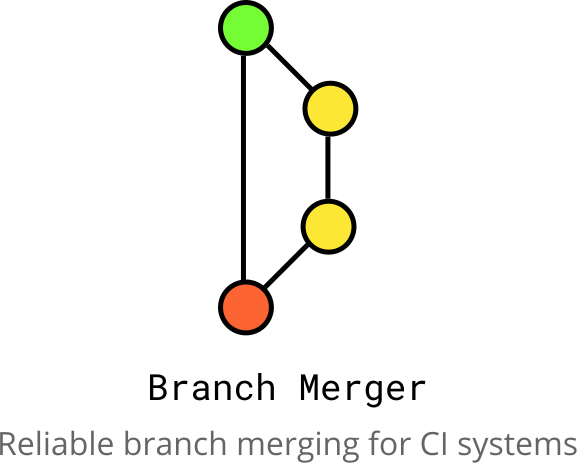

  
   
   
  
   
   
  

    Branch Merger is a CLI tool for CI systems that merges your branches through merge/pull requests.
  

> Branch Merger is currently in active development so this Project and all features may not be complete.   For a full view of project progress please go to the [Projects page](https://github.com/tomchinery/branch-merger/projects). 

## Contents

@TODO: Write contents / rest of readme

## Installation

**Locally:**
@TODO: Write local installation

**Github Action:**
@TODO: Write Github Action installation

**BitBucket Pipe:**
@TODO: Write BitBucket pipe installation

**Google Cloud Build:**
@TODO: Write Google Cloud Build installation

## Usage

**Locally:**
@TODO: Write local usage

**Github Action:**
@TODO: Write Github Action usage

**BitBucket Pipe:**
@TODO: Write BitBucket Pipe usage

**Google Cloud Build:**
@TODO: Write Google Cloud Build usage

## Contributing

Please take a look at the [wiki](https://github.com/tomchinery/branch-merger/wiki).

## License

[MIT License](https://github.com/tomchinery/branch-merger/blob/main/LICENSE.md)
